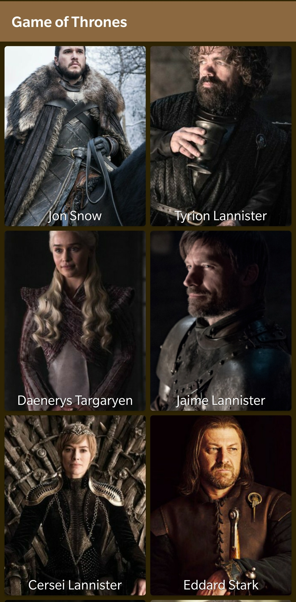
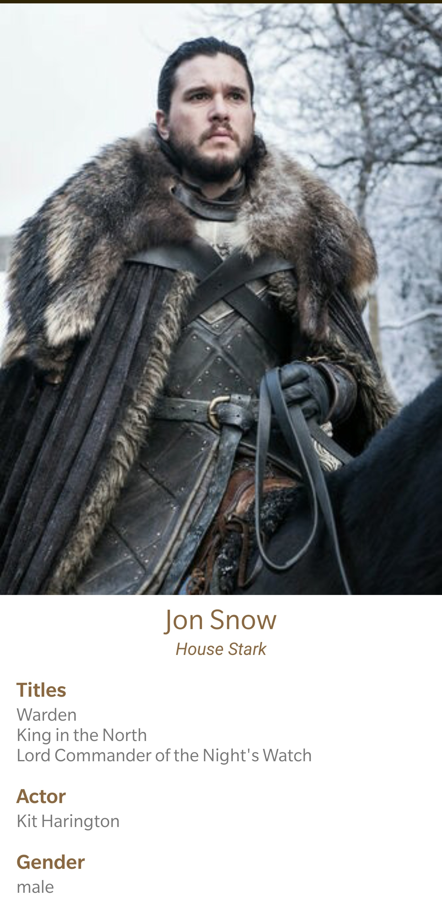

# game-of-thrones-android

Android app written in Kotlin that consumes Game of Thrones API (https://api.got.show).

Currently it only has two screens:
- List of all tv show characters
- Detailed info about a character

 
